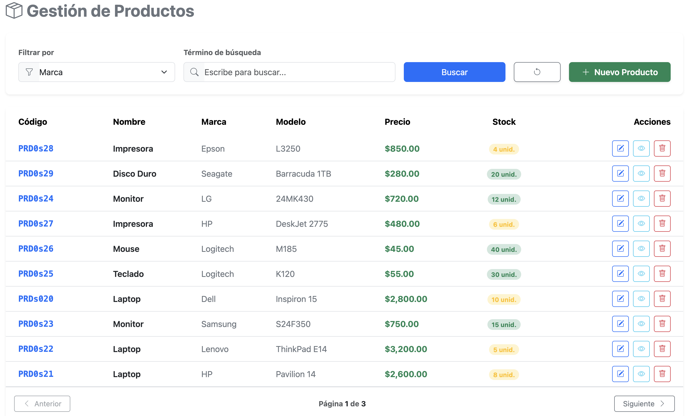

# **Fullstack Products – CRUD de Productos**

Proyecto **Fullstack (Spring Boot + Angular)** desarrollado como **reto técnico**, orientado a la gestión de productos mediante un CRUD completo, utilizando **Oracle Database** como motor de base de datos.

El sistema permite registrar, listar, actualizar y eliminar productos, aplicando buenas prácticas de arquitectura, validaciones y separación de responsabilidades.


---
## 🔍 Lógica de Estados de Productos

### Estados Disponibles

El sistema maneja **dos estados** para los productos en la base de datos:

- **`A` - ACTIVO**: Producto visible y disponible
- **`I` - INACTIVO**: Producto oculto (eliminación lógica)

### ⚠️ Importante: Visualización de Estados

**El listado de productos en el frontend SOLO muestra productos con estado ACTIVO (`A`).**

Los productos con estado INACTIVO (`I`) **NO se visualizan** en la interfaz, pero permanecen en la base de datos para mantener la integridad referencial y el historial.

### Flujo de Eliminación

Cuando se elimina un producto:
1. ❌ **NO se borra físicamente** de la base de datos
2. 🔄 Su estado cambia de `A` a `I`
3. 👁️ Deja de aparecer en el listado del frontend
4. 💾 Se conserva en la base de datos para auditoría

---

## 📅 Gestión Automática de Fechas

El sistema maneja automáticamente las siguientes fechas:

### `fecha_creacion`
- ✅ Se asigna **automáticamente** al crear un producto
- 🔒 **No se puede modificar** manualmente
- ⏰ Registra el timestamp exacto de creación

### `fecha_modificacion`
- ✅ Se actualiza **automáticamente** en cada modificación
- 🔄 Se actualiza al editar cualquier campo del producto
- ⏰ Registra el timestamp de la última modificación

> **Nota**: El usuario **no debe preocuparse** por gestionar estas fechas, el sistema las controla de forma transparente.

---
## 📋 **Tecnologías Utilizadas**

| Tecnología | Versión / Descripción |
|-----------|------------------------|
| ☕ **Java** | 8 |
| 🌱 **Spring Boot** | 2.x |
| 🟠 **Oracle Database** | 19c+ |
| 🟢 **Node.js** | v18+ |
| 🔺 **Angular CLI** | v17+ |
| 🎨 **Bootstrap** | Estilos UI |
| 🔔 **SweetAlert2** | Alertas y formularios |
| 🧩 **Maven** | Gestión de dependencias |

---

## 🚀 **Guía de Instalación y Ejecución**

Sigue estos pasos para levantar el proyecto localmente.

---

## 🗄️ **1. Configuración de la Base de Datos (Oracle)**

1. Abre tu cliente Oracle *(SQL Developer, DBeaver, etc.)*
2. Ejecuta el script `conexionProductos.sql` ubicado en la raíz del repositorio
3. Este script realiza las siguientes acciones:
   - Creación de la tabla **PRODUCTO**
   - Creación de la secuencia **SEQ_PRODUCTO**
   - Creación del **Stored Procedure `SP_CREAR_PRODUCTO`**
   - Inserción de **10 productos** utilizando el Stored Procedure

📄 **Archivo:** `conexionProductos.sql`

---

## ⚙️ **2. Ejecución del Backend (Spring Boot)**

### 📁 Navegación al proyecto
```bash
cd products-app
```

### 🔧 Configuración de la base de datos

Edita el archivo `src/main/resources/application.properties`:
```properties
server.port=8080

# Configuración de Oracle Database
spring.datasource.url=jdbc:oracle:thin:@localhost:1521/XEPDB1
spring.datasource.username=TU_USUARIO_ORACLE
spring.datasource.password=TU_PASSWORD_ORACLE
spring.datasource.driver-class-name=oracle.jdbc.OracleDriver

# Configuración de JPA
spring.jpa.hibernate.ddl-auto=none
spring.jpa.show-sql=true
spring.jpa.properties.hibernate.format_sql=true
spring.jpa.properties.hibernate.dialect=org.hibernate.dialect.Oracle12cDialect
```

### ▶️ Compilación y ejecución
```bash
# Instalar dependencias
mvn clean install

# Ejecutar la aplicación
mvn spring-boot:run
```

El backend estará disponible en: **http://localhost:8080**

### ⚠️ Nota Importante

Para evitar errores de compilación, asegúrate de tener instalado el **plugin de Lombok** en tu IDE (IntelliJ IDEA, VS Code o Eclipse).

---

## 💡 **3. Ejecución del Frontend (Angular)**

### 📁 Navegación al proyecto
```bash
cd frontend-products
```

### 📦 Instalación de dependencias
```bash
npm install
```

### ▶️ Inicio del servidor de desarrollo
```bash
ng serve -o
```

El frontend se abrirá automáticamente en: **http://localhost:4200/productos**

### 🔧 Configuración de la URL del API

Si cambias el puerto del backend, actualiza el archivo `src/core/services/producto.service.ts`:
```typescript
import { Injectable } from '@angular/core';
import { HttpClient } from '@angular/common/http';
import { Observable } from 'rxjs';

@Injectable({
  providedIn: 'root'
})
export class ProductoService {
  
  private apiUrl = 'http://localhost:8080/api/productos';

  constructor(private http: HttpClient) { }


}
```

---

## 🌎 **URLs Disponibles**

| Servicio | URL |
|----------|-----|
| 🌐 **Frontend** | http://localhost:4200/productos |
| ⚙️ **Backend API** | http://localhost:8080 |

---

## 🧪 **Pruebas de API**

### 📬 Colección Postman

Se ha incluido una colección Postman para probar todos los endpoints del sistema.

📁 **Archivo:** `Api-productos.postman_collection.json`

#### Endpoints incluidos:

- ✅ **Crear producto** - `POST /api/productos`
- 📋 **Listar productos** - `GET /api/productos`
- 🔄 **Actualizar producto** - `PUT /api/productos/{id}`
- ❌ **Eliminar producto** - `DELETE /api/productos/{id}`

---

## 📂 **Estructura del Proyecto**
```
fullstack-products/
├── products-app/                # Backend Spring Boot
│   ├── src/
│   │   ├── main/
│   │   │   ├── java/
│   │   │   │   └── com/example/products/
│   │   │   └── resources/
│   │   │       └── application.properties
│   │   └── test/
│   └── pom.xml
│
├── frontend-products/           # Frontend Angular
│   ├── src/
│   │   ├── app/
│   │   └── core/
│   │       └── services/
│   │           └── producto.service.ts
│   ├── angular.json
│   └── package.json
│
├── conexionProductos.sql        # Script de base de datos
└── Api-productos.postman_collection.json
```
---

## 🛠️ **Características del Sistema**

- ✨ CRUD completo de productos
- 🔒 Validaciones en frontend y backend
- 🎨 Interfaz responsive con Bootstrap
- 🔔 Notificaciones visuales con SweetAlert2
- 🗄️ Uso de Stored Procedures en Oracle
- 🧩 Arquitectura por capas (Controller, Service, Repository)
- 📦 DTOs para transferencia de datos
- 🔧 Manejo centralizado de excepciones

---

## 👨‍💻 **Autor**

Ruben Angel Ocaña.
